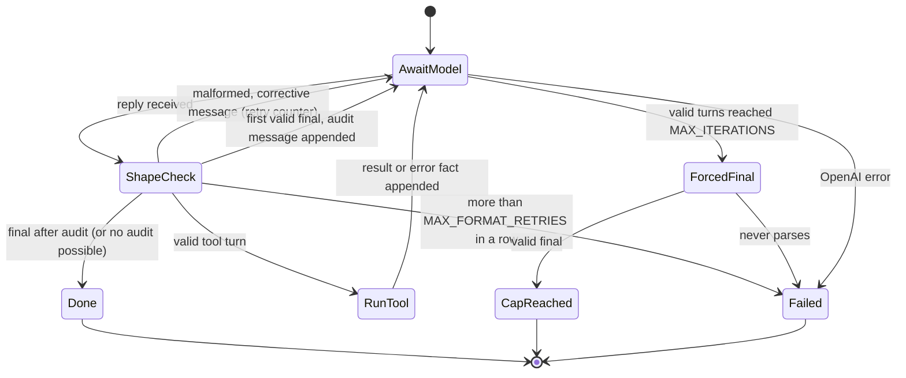
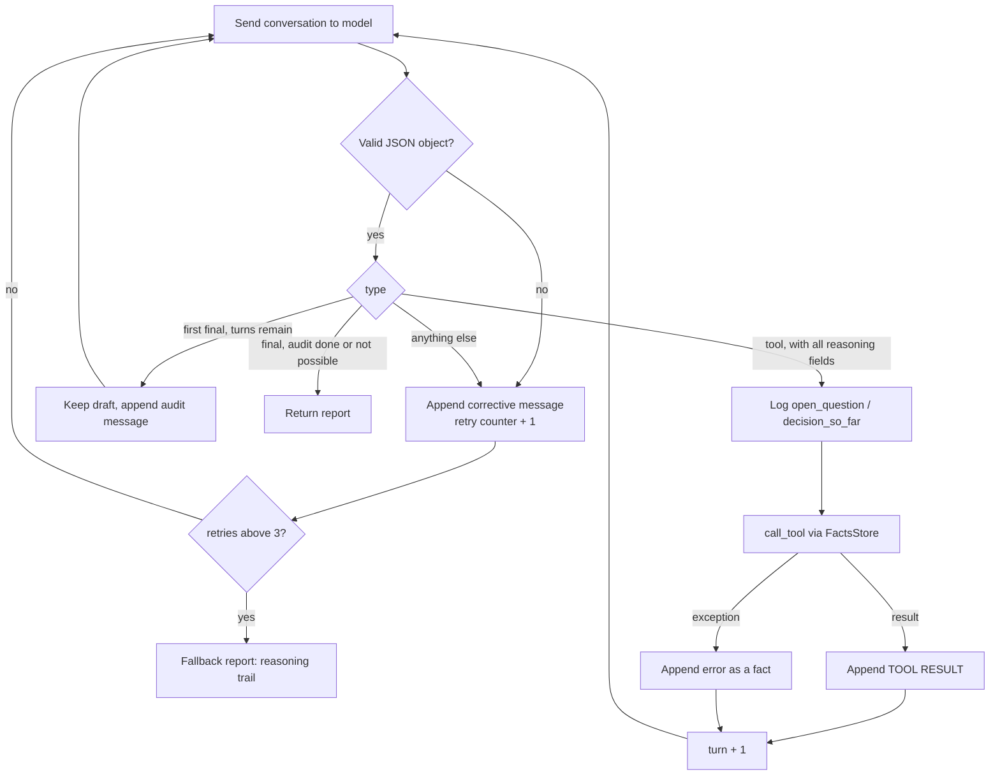
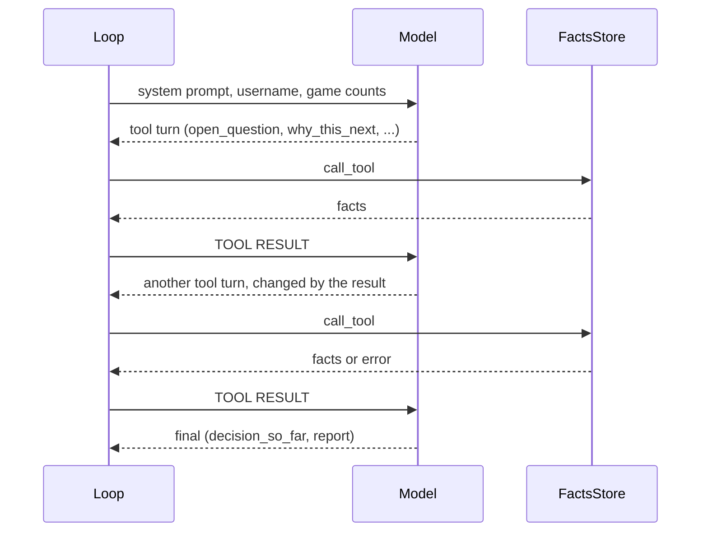

# Agent Loop

[loop.py](../agent/loop.py) is a hand-rolled loop: send the conversation to the model, check the shape of its JSON reply, run the requested tool in plain Python, feed the result back. The model picks every next question; the loop only checks shape, logs, and enforces the cap.

## Turn shape

Every reply is one JSON object. A tool turn carries the call plus the model's own reasoning; a final turn carries the report.

| Field | Tool turn | Final turn |
|-------|-----------|------------|
| `type` | `"tool"` | `"final"` |
| `name`, `args` | tool name, JSON object | n/a |
| `open_question` | required | n/a |
| `why_this_next` | required | n/a |
| `would_change_my_mind_if` | required | n/a |
| `decision_so_far` | required | required |
| `report` | n/a | required, Markdown |

The loop requires these fields to be non-empty strings (`TURN_REASONING_KEYS`) but never judges their content. Each turn's `open_question` and `decision_so_far` are logged to stderr and stay in the conversation.

## Loop states

| Constant | Value | Meaning |
|----------|-------|---------|
| `MAX_ITERATIONS` | 20 | Valid model turns before a report is forced (`--max-turns` overrides) |
| `MAX_FORMAT_RETRIES` | 3 | Consecutive malformed replies tolerated; they do not use turns |
| `AUDIT_ROUNDS` | 1 | Self-audit rounds after the first final answer |
| `DEFAULT_MODEL` | `gpt-5.4-mini` | Overridden by `OPENAI_MODEL` |
| `TEMPERATURE` | 0.4 | Dropped automatically if the model rejects it |

`response_format={"type": "json_object"}` is sent; if the model rejects it (or `temperature`), the session drops that parameter and retries.

## One iteration

## No final before facts

The first user message says the game data is only available through the tools. A `final` sent before any tool has been called is rejected with a corrective message (it uses the format-retry counter, not a turn): the model has seen no facts, so a report would be invented or an empty refusal. This is what stopped a run where `gpt-5.4-mini` answered "no tool results provided" instead of calling a tool.

## Run status line and self-audit

After every tool result the loop appends one plain-facts line, for example `RUN STATUS: turns used 4 of 20; engine tool calls so far 1; games with engine analysis 1.` It carries no advice.

When the model sends its first valid `final` and turns remain, the loop appends a fixed audit message (`AUDIT_MESSAGE`): check every claim, number, game index and move against the tool results, check who made each move (player vs. opponent), check the arithmetic, check the report against the stated standards (ranking, confidence, rejected idea, small samples), then resend or revise. The model may call a tool during the audit. Only one round runs, it is skipped when the first final lands on the last turn, and if the audit reply fails to parse or the model call errors the first draft is kept. The report header shows `Self-audit:` as not run, kept unchanged, or revised.

## A typical run

The sequence below is an example; which tools run, how often, and in what order is the model's choice and differs per player.

## Termination and error paths

| Situation | `AgentRun.status` | Report body |
|-----------|-------------------|-------------|
| Valid final turn | `final` | Model's report |
| Cap hit, forced call returns a final | `cap_reached` | Model's best-effort report; header says "Cap reached" |
| Replies never parse (including the forced call) | `unparseable` | Reasoning trail |
| OpenAI error (auth, network) | `model_error` | Reasoning trail |

Unknown tools, missing or unexpected arguments, bad indexes and engine errors all return to the model as `{"error": ...}` and cost a normal turn. In all four cases [main.py](../main.py) writes exactly one report; the last two exit with code 2.

## System prompt

The prompt states the goal, the evidence standard (every claim traceable to a tool result, no invented games or numbers, no good/bad claims without engine support, state sample sizes), and the decisiveness rules (rank, confidence, action, at least one rejected idea). It does not contain a question list or a call order. The tool descriptions are injected from `TOOL_SCHEMA`.

## See also

- [tools.md](tools.md)
- [data-flow.md](data-flow.md)
- [design-decisions.md](design-decisions.md)
- [index.md](index.md)
