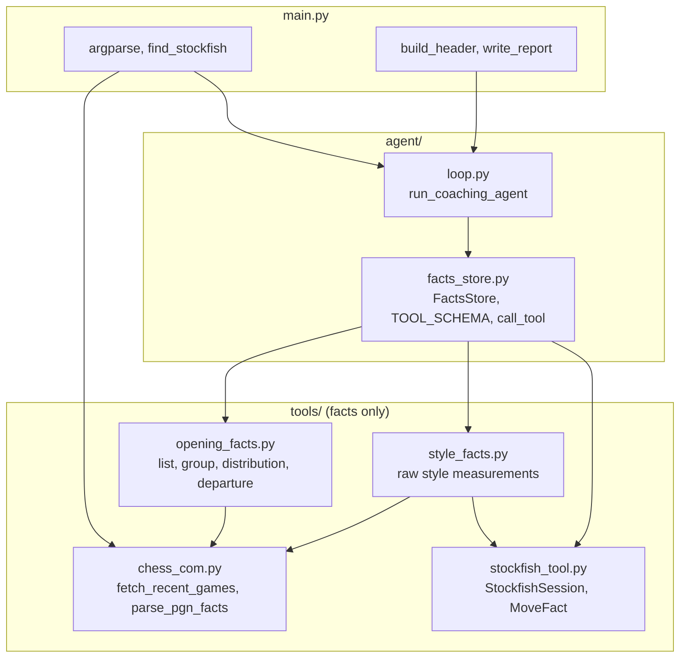
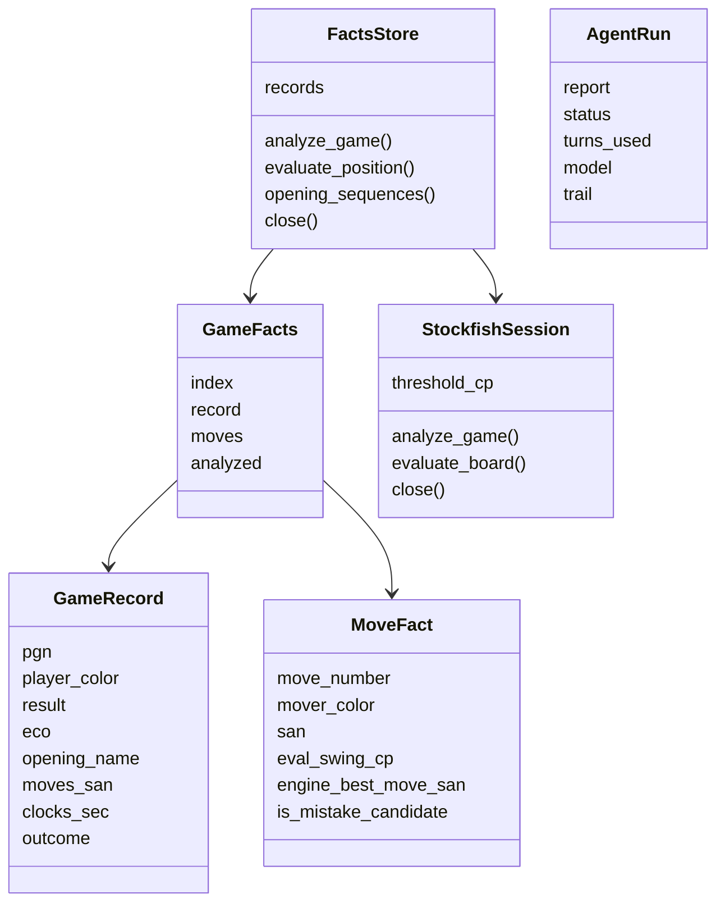
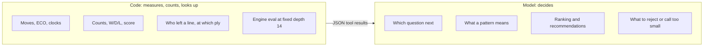

# Architecture

Three layers: `tools/` measures and counts, `agent/` routes tool calls and runs the model loop, `main.py` wires them together and writes the report. Interpretation lives only in the model.

## Modules

| Module | Responsibility |
|--------|----------------|
| [main.py](../main.py) | CLI, loads games, creates the engine session and store, writes the single report |
| [agent/loop.py](../agent/loop.py) | Only code that calls OpenAI; checks turn shape, logs reasoning, caps turns |
| [agent/facts_store.py](../agent/facts_store.py) | Holds games, caches engine results, validates arguments, routes tool calls |
| [tools/chess_com.py](../tools/chess_com.py) | Chess.com API fetch and PGN parsing (headers, SAN moves, clocks) |
| [tools/opening_facts.py](../tools/opening_facts.py) | Counting/grouping over move lists |
| [tools/style_facts.py](../tools/style_facts.py) | Raw measurements a model can infer style from |
| [tools/stockfish_tool.py](../tools/stockfish_tool.py) | Fixed-depth engine measurements |

## Key types

## Facts vs. judgment

No tool ranks lines, names a style, or recommends anything, and there is no opening book or ECO-to-advice table.

## See also

- [agent-loop.md](agent-loop.md)
- [tools.md](tools.md)
- [design-decisions.md](design-decisions.md)
- [index.md](index.md)
