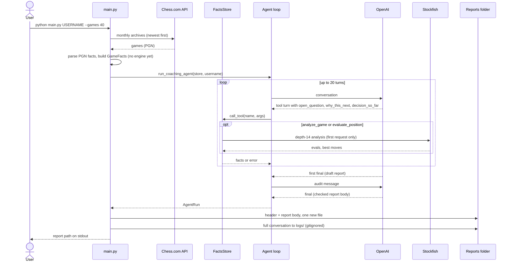
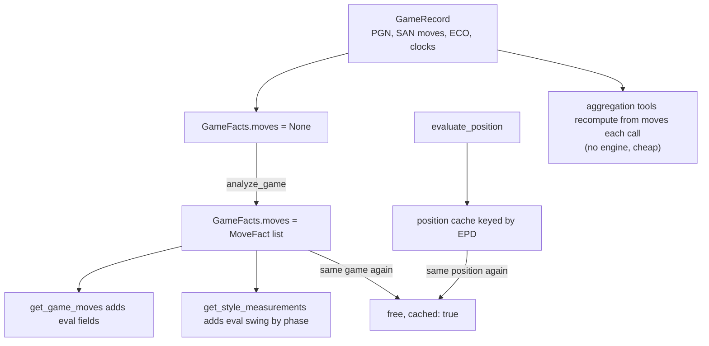
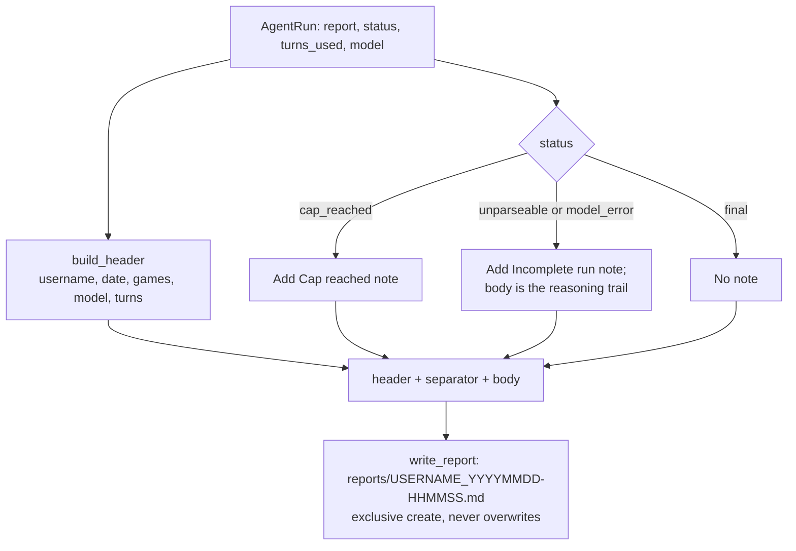

# Data Flow

From CLI input to one Markdown report: games are fetched once, everything else is computed on demand when the agent asks, and engine results are cached for the rest of the run.

## End to end

## How facts are stored and reused

## Report writing

The only code-generated part of the file is the short header. Section headings in the body are the model's. `reports/.gitkeep` keeps the folder in git; reports themselves are not ignored.

## See also

- [agent-loop.md](agent-loop.md)
- [tools.md](tools.md)
- [setup-and-usage.md](setup-and-usage.md)
- [index.md](index.md)
