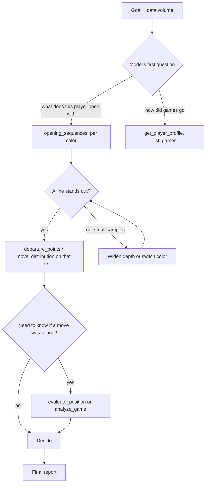

# Design Decisions

This is a hand-rolled agent because the course requires code you wrote to call a language model, and because the path genuinely depends on what the model finds. The model chooses its own next question each turn; nothing in code or prompt lists the questions.

## Rule-based vs. model-judged

```mermaid
flowchart LR
    subgraph RULES["Deterministic: code decides"]
        R1["Which games: rapid/blitz, newest first"]
        R2["Engine effort: depth 14 everywhere"]
        R3["Mistake candidate: swing >= 100 cp<br/>(--threshold, fixed per run)"]
        R4["Turn cap: 20, size caps on every result"]
        R5["Tool routing, argument checks, error capture"]
        R6["Report file and header"]
    end
    subgraph MODEL["Model-judged: OPENAI_MODEL decides"]
        M1["Which question to ask next, and why"]
        M2["Which color, line or game to dig into"]
        M3["Whether and where to spend engine time"]
        M4["What a pattern means for this player"]
        M5["Ranking, recommendations, rejections"]
        M6["When it has enough to finish"]
    end
    RULES -->|"facts as JSON"| MODEL
```

## Why these choices

| Decision | Reason |
|----------|--------|
| Hand-rolled loop in [loop.py](../agent/loop.py) | The course test: your own code makes the LLM API call and runs the tools ([requirements/](../requirements)) |
| Per-turn `open_question`, `why_this_next`, `would_change_my_mind_if`, `decision_so_far` | Makes the agent's choice of path visible and auditable; the loop checks shape only |
| No question list in prompt or code | A fixed list would make this a script, not an agent |
| Tools return facts only, no opening book | Keeps "what happened" separate from "what it means"; recommendations must come from the player's own data |
| Engine on demand, cached | The agent decides which games and positions deserve engine time; repeats are free |
| Fixed depth and threshold | Same ruler for every position; flags candidates, never verdicts |
| Size-bounded results with `truncated` | A long investigation cannot overflow the context window |
| Format retries separate from turns | A malformed reply should not burn an investigation turn |
| One self-audit round after the first final | Models misread or mis-added figures; a generic check against their own tool results catches some of it without telling them what to ask |
| Run status line after each tool result | The model can see turns and engine use; facts only, no instructions |
| Every move tagged player/opponent in tool rows | Flat move lists got misattributed to the wrong side |
| Transcripts in gitignored `logs/` | Claims can be audited afterwards; `reports/` still gets exactly one file |
| Forced final report at the cap | A run always ends with a decision-bearing report instead of a canned failure |
| One report per run, written by code | The durable artifact is deterministic; sections are the agent's choice |
| Bullet and daily games excluded | Bullet is too fast to reflect real decision-making |
| Only the player's own public data | No private or third-party data, per the brief |

## Why the path varies

These branches are examples of paths a model might take. Which tools run, how many times and in what order is decided at run time and differs by player and sample size.

## Known limits

- Lines are matched by move order, not position, so transpositions are not merged.
- Report quality depends on the model. In testing `gpt-4o-mini` and `gpt-4o` skipped ranking, confidence and rejected ideas and misread figures; the default `gpt-5.4-mini` followed the standards and its spot-checked figures were right. It still over-reads small samples and used the engine only once. The loop checks the shape of each turn, not whether claims are true; the audit round is a model checking itself, not a guarantee.
- Mistake candidates cover both players' moves; the `mover` field says which side made each.
- History lookup stops at 24 months, so inactive accounts return no games.

## See also

- [architecture.md](architecture.md)
- [agent-loop.md](agent-loop.md)
- [tools.md](tools.md)
- [index.md](index.md)
