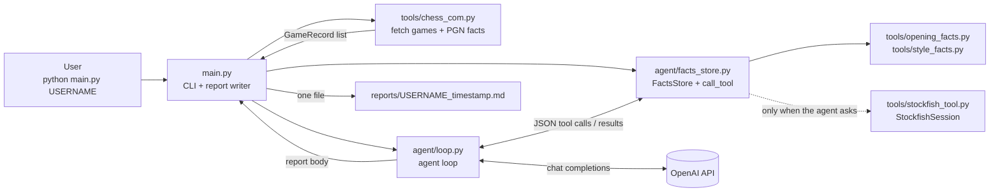
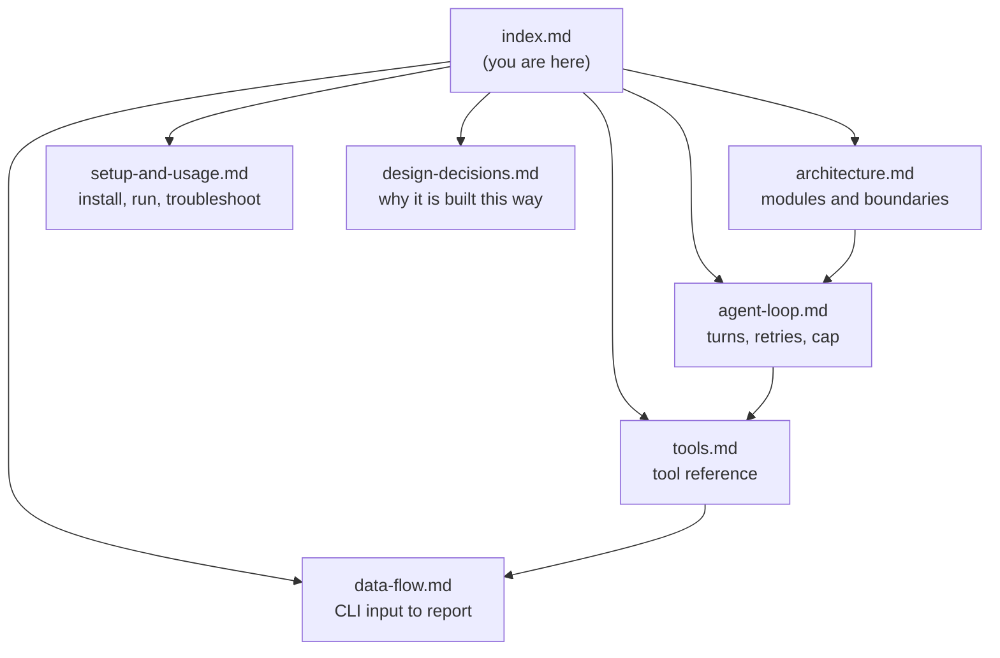

# Chess Coach Agent: Documentation

A hand-rolled LLM agent that turns facts about a Chess.com player's recent games into one coaching report with ranked, evidence-backed decisions. Code supplies facts; the model chooses its own questions and makes every judgment.

## The system at a glance

Plain Python fetches and counts; the model decides what to ask next, what it means, and what to recommend.



## Doc map



| Doc | What it covers |
|-----|----------------|
| [architecture.md](architecture.md) | Modules, responsibilities, the facts-vs-judgment boundary |
| [agent-loop.md](agent-loop.md) | Turn shape, 20-turn cap, format retries, forced report, error paths |
| [tools.md](tools.md) | The 9 agent-callable tools and their bounds |
| [data-flow.md](data-flow.md) | End-to-end sequence, engine caching, report writing |
| [setup-and-usage.md](setup-and-usage.md) | Install, Stockfish, `.env`, CLI args, tests, troubleshooting |
| [design-decisions.md](design-decisions.md) | Why the agent picks its own questions; deterministic vs. model-judged |

## Quick start

See [setup-and-usage.md](setup-and-usage.md). In short:

```powershell
.venv\Scripts\python main.py <chess.com-username> --games 40
```

The report path is printed on stdout.

## See also

- [README.md](../README.md): project pitch and short setup
- [main.py](../main.py): CLI entry point
