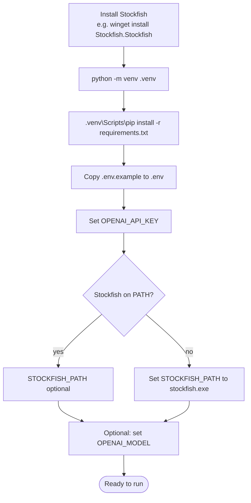
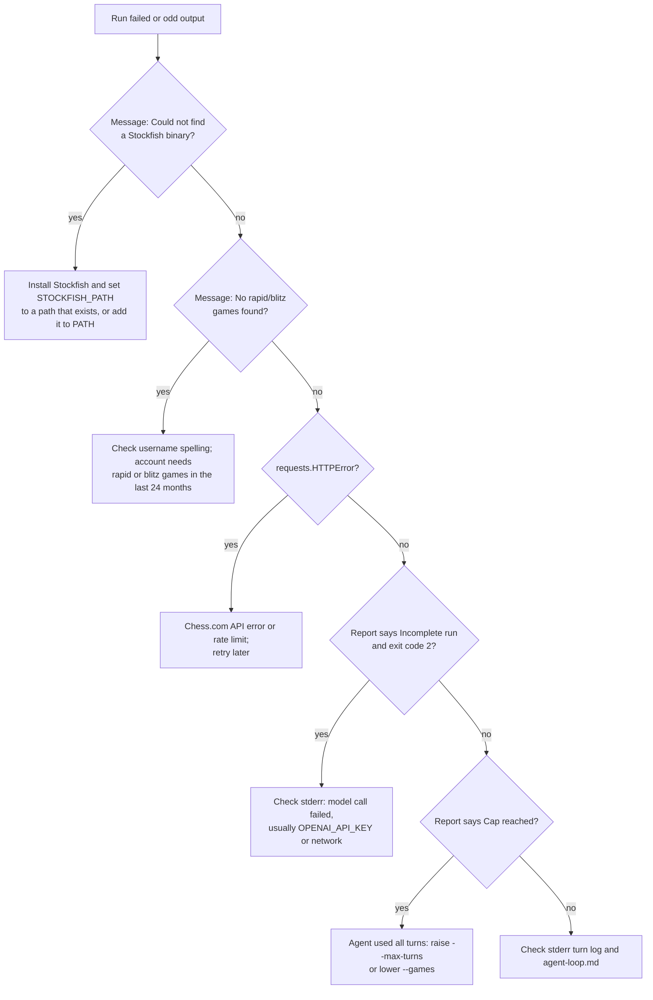

# Setup and Usage

Install Stockfish and the Python dependencies, add your OpenAI key to `.env`, then run `main.py` with a Chess.com username. Each run writes one report to `reports/`.

## Setup



Dependencies ([requirements.txt](../requirements.txt)):

| Package | Version | Used for |
|---------|---------|----------|
| `chess` | 1.11.1 | PGN parsing, UCI engine control |
| `requests` | 2.32.3 | Chess.com API |
| `openai` | 1.59.7 | Agent loop model calls |
| `python-dotenv` | 1.0.1 | Loading `.env` |

Environment variables (template: [.env.example](../.env.example)):

| Variable | Required | Purpose |
|----------|----------|---------|
| `OPENAI_API_KEY` | yes | Read by the OpenAI client |
| `STOCKFISH_PATH` | optional if `stockfish` is on `PATH` | Full path to the Stockfish binary; used first if the path exists |
| `OPENAI_MODEL` | no | Model for the agent loop; default `gpt-5.4-mini`. `gpt-4o-mini` and `gpt-4o` gave unranked, less accurate reports in testing |

## Run

```powershell
.venv\Scripts\python main.py <chess.com-username> --games 40
```

| Argument | Default | Meaning |
|----------|---------|---------|
| `username` | required | Chess.com username to analyze |
| `--games` | `40` | Number of recent rapid/blitz games to load |
| `--threshold` | `100` | Centipawn swing that flags a mistake candidate (fixed for the run) |
| `--max-turns` | `20` | Agent turn cap before a report is forced |

Only rapid and blitz standard-chess games from the player's public history are used, looking back at most 24 months. Progress and the agent's per-turn `open_question` / `why_this_next` / `decision_so_far` go to stderr; the report path goes to stdout. Stockfish runs only when the agent asks for it (about 10 seconds for a long game at depth 14).

The full conversation (every tool result the model saw) is written to `logs/<username>_<timestamp>.jsonl`, which is gitignored; its path is printed to stderr. Use it to check a report's claims.

Exit code is 0 for a normal or cap-reached report and 2 when the run ended with only a reasoning-trail report.

## Tests

```powershell
.venv\Scripts\python -m unittest discover -s tests -t .
```

Offline: fixture games, a fake engine and a scripted fake OpenAI client; no network, no Stockfish, no API key.

## Troubleshooting



## See also

- [data-flow.md](data-flow.md)
- [agent-loop.md](agent-loop.md)
- [README.md](../README.md)
- [index.md](index.md)
