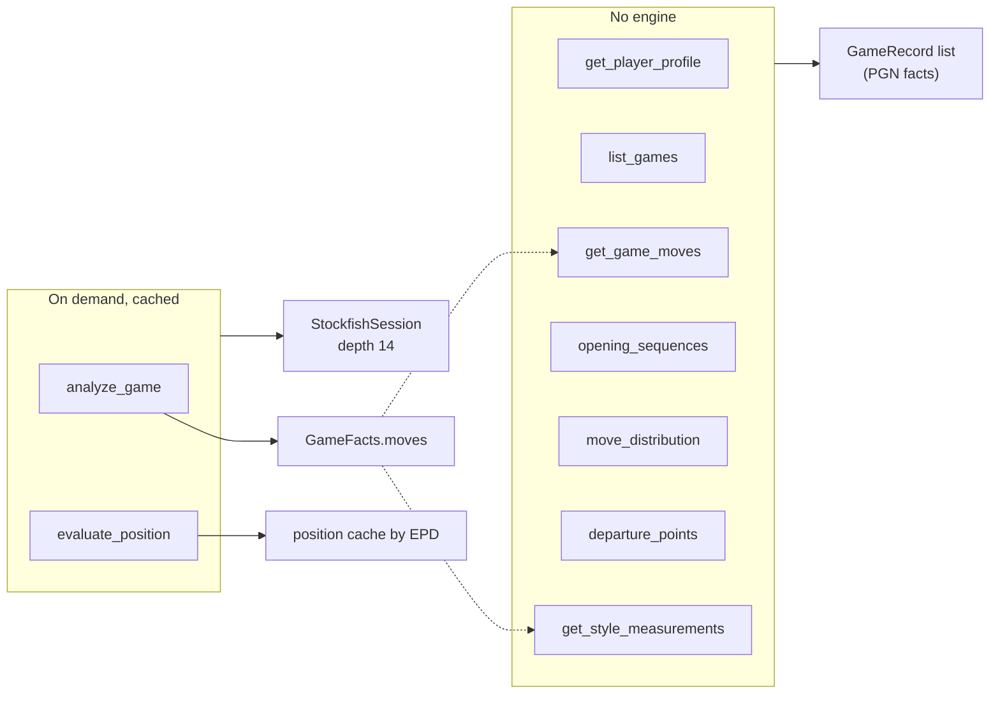
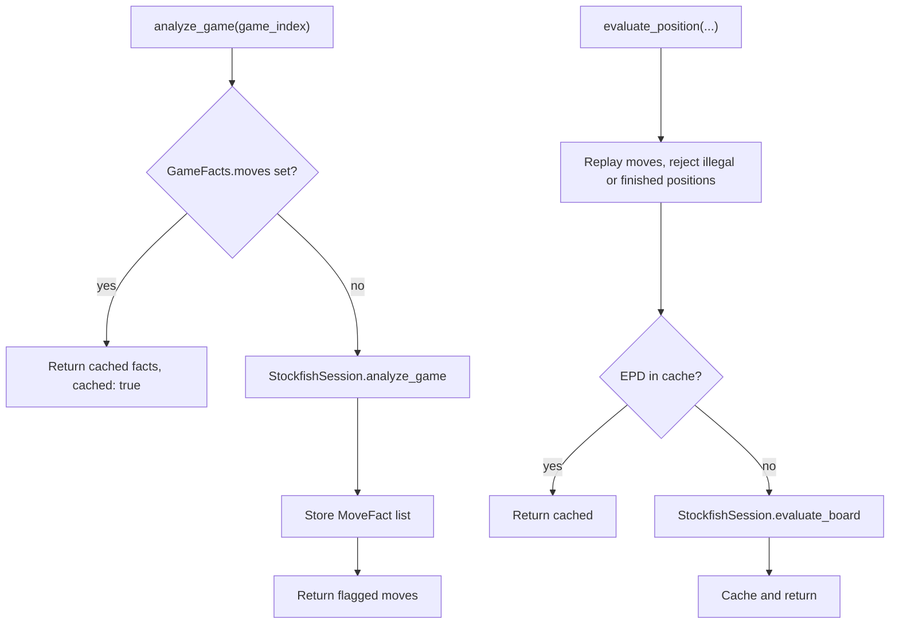
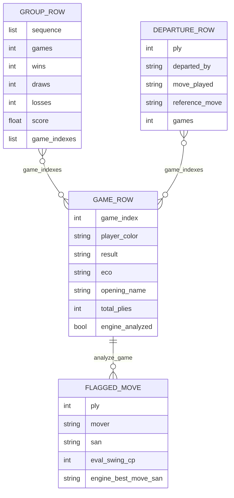

# Tools

Nine tools, all facts-only: they measure, count, group and look up. The model reaches them through the single router `call_tool` in [facts_store.py](../agent/facts_store.py); descriptions the model sees live in `TOOL_SCHEMA`.

## Tool map

Lines are matched by move order (SAN), so transpositions are not merged. A line can be a list (`["e4","e5"]`) or a string (`"1. e4 e5"`); `+ # ! ?` suffixes are ignored.

## Reference

| Tool | Args (required in bold) | Returns |
|------|-------------------------|---------|
| `get_player_profile` | none | games per color, W/D/L, time classes, rating range, engine-analyzed count, depth, threshold |
| `list_games` | `color`, `offset`, `limit` | per-game metadata, ECO, opening name, total plies, first 6 plies, `engine_analyzed` |
| `get_game_moves` | **`game_index`**, `from_ply`, `to_ply` | SAN by ply with who moved, clock after the move; engine fields if analyzed |
| `opening_sequences` | **`color`**, `depth_plies`, `min_games`, `perspective` | groups by first N plies: games, W/D/L, score, example games, ECO codes |
| `move_distribution` | **`color`**, **`prefix`**, `min_games` | next move after a prefix, who played it, W/D/L per move |
| `departure_points` | **`color`**, **`line`**, `min_games` | first ply each game left a reference line, who left, move played, W/D/L |
| `get_style_measurements` | `color` | per-game and per-color raw measurements; eval swing by phase for analyzed games |
| `analyze_game` | **`game_index`** | flagged moves from a whole-game Stockfish pass |
| `evaluate_position` | `moves`, `game_index`, `after_ply` | eval (both perspectives), best move, short principal variation |

`score` is wins plus half the draws, over games. `perspective` for `opening_sequences` is `full_line` (default) or `player_moves_only`. For `evaluate_position`, `after_ply` is required with `game_index` and is not allowed alone.

## Bounds

Every result is size-bounded and flags it with `truncated: true` when something was cut.

| Constant | Value | Applies to |
|----------|-------|-----------|
| `MAX_ROWS` | 25 | rows from list/aggregation tools, flagged moves from `analyze_game`, per-game rows in style measurements |
| `MAX_EXAMPLE_GAMES` | 8 | game indexes listed per row |
| `MAX_DEPTH_PLIES` | 30 | `depth_plies` ceiling |
| `MAX_PLIES_PER_CALL` | 60 | plies per `get_game_moves` call |

Groups below `min_games` are left out of `rows` but counted (`groups_below_min_games` and similar), so small samples stay visible.

## Style measurements (numbers only)

From [style_facts.py](../tools/style_facts.py): total plies; each side's castling side and ply; captures by each side through move 20 (`TRADE_WINDOW_MOVES`); queens left after move 20; the player's queen moves within the first 10 moves (`EARLY_QUEEN_WINDOW_MOVES`). `eval_swing_by_phase` averages centipawns lost per move in fixed buckets (moves 1-10, 11-30, 31+) for games already analyzed. No labels are returned.

## Engine tools

[stockfish_tool.py](../tools/stockfish_tool.py): `ANALYSIS_DEPTH = 14` for every position; `MISTAKE_THRESHOLD_CP = 100` flags a move as a mistake candidate when the mover's eval dropped by at least that many centipawns, fixed for the run (`--threshold` sets it once); `MATE_SCORE_CP = 10000` stands in for mate. The engine process starts lazily on first use and is closed by `FactsStore.close()`. If Stockfish is not available, engine tools return `{"error": "engine unavailable in this run"}`.

## Data shapes

## Chess.com source

[chess_com.py](../tools/chess_com.py) walks the monthly archives backwards (at most 24 months) until it has `count` standard-chess games in rapid or blitz, newest first. `parse_pgn_facts` reads `ECO`, `ECOUrl` (opening name from its slug), `Termination`, `TimeControl`, the SAN mainline and `[%clk]` clocks. `GameRecord.outcome` collapses result codes to win/draw/loss; draw codes: agreed, repetition, stalemate, insufficient, 50move, timevsinsufficient.

## Errors

Unknown tool, missing or unexpected arguments, a non-object `args`, out-of-range `game_index`, bad color, illegal moves, or an unavailable engine all raise `ValueError`; the loop turns that into an `{"error": ...}` fact for the model.

## See also

- [agent-loop.md](agent-loop.md)
- [data-flow.md](data-flow.md)
- [architecture.md](architecture.md)
- [index.md](index.md)
